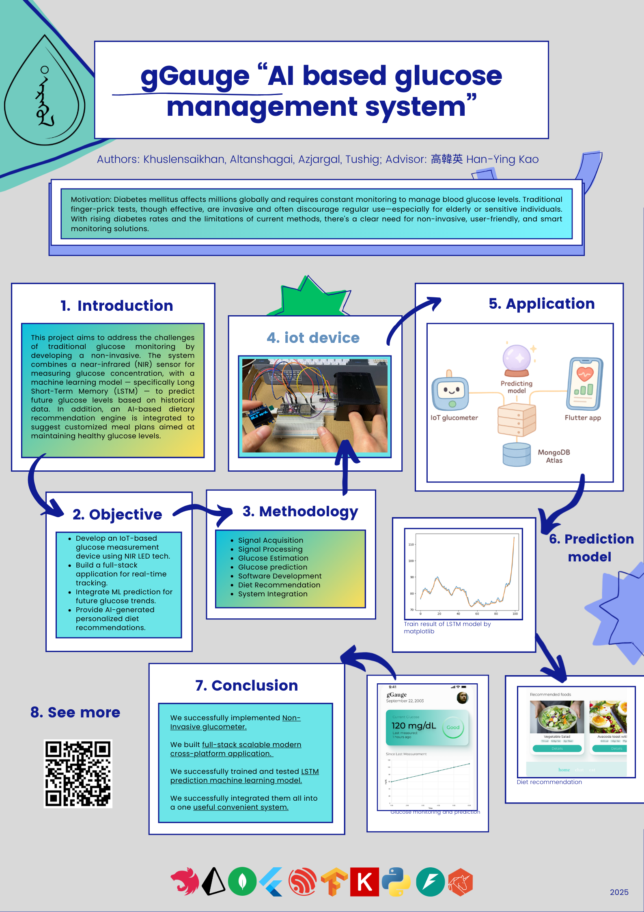

# 🩸 gGauge Backend API

This repository contains the **backend service** for the **gGauge Flutter mobile application**, a smart health monitoring system designed to track glucose levels, provide AI-powered health assistance, and generate personalized food recommendations.

The backend handles:

* User authentication & profile management
* Glucose data ingestion from a **custom-made glucometer**
* AI-powered health chat using **ChatGPT**
* Glucose trend prediction after multiple readings
* Personalized food recommendations
* Secure API communication with JWT authentication

The API is fully tested using **Postman** and deployed on **Render**.

---

## 🚀 Features

✅ User Authentication (Signup, Login, JWT-based authorization)
✅ User Profile Management (CRUD operations)
✅ Real-time Glucose Data Collection
✅ AI Health Assistant (Chat with ChatGPT)
✅ Glucose Prediction System (after 5 readings)
✅ Personalized Food Recommendations
✅ Secure REST API
✅ Cloud Deployment (Render)

---

## 🧠 System Overview

The gGauge backend works as an intelligent health engine that:

1. Authenticates users securely.
2. Receives glucose data from a custom glucometer device.
3. Stores and analyzes glucose readings.
4. Generates predictions after stable reading patterns.
5. Uses AI (ChatGPT) to provide health guidance.
6. Recommends food based on glucose trends and user profile.

---



---

## 🔐 Authentication Endpoints

### ✅ Signup

**POST**

```
/auth/signup
```

```json
{
  "email": "tester@testermail.com",
  "password": "Tester.0922",
  "confirmPassword": "Tester.0922",
  "firstName": "FirstTester",
  "lastName": "LastTester",
  "sex": "female",
  "age": 18,
  "pregnancy": "Yes",
  "nationality": "Argentina"
}
```

---

### ✅ Login

**POST**

```
/auth/login
```

```json
{
  "email": "testuser@testmail.com",
  "password": "Csie1234"
}
```

Returns a **JWT token** used for all protected routes.

---

## 👤 User Management

### 🔍 Get User Profile

**GET**

```
/users/profile
```

Requires `Authorization: Bearer <token>`

---

### ✏️ Update User

**PATCH**

```
/users/:id
```

```json
{
  "firstName": "newFirstName",
  "age": 69,
  "weight": 70,
  "height": 180,
  "contact": 99119911,
  "blood": "A",
  "allergies": "Nuts"
}
```

---

### 🗑️ Delete User

**DELETE**

```
/users/:id
```

---

## 💬 AI Health Assistant (ChatGPT)

### ✅ Create New Chat

**POST**

```
/api/chat/health-assistant
```

---

### ✅ Get All Chats

**GET**

```
/api/chat
```

---

### ✅ Get Chat by ID

**GET**

```
/api/chat/:id
```

---

### ✅ Send Message to Chat

**POST**

```
/api/chat/:id/messages
```

```json
{
  "content": "Can you tell me about my information?"
}
```

The assistant responds using **user medical context + ChatGPT AI**.

---

## 🩸 Glucose Monitoring

### ✅ Send Glucose Data (from Glucometer)

**POST**

```
/glucose
```

```json
{
  "userId": "682310318a5b6242241304fa",
  "value": 227.3
}
```

---

### ✅ Get Glucose Readings

**GET**

```
/glucose/:userId/readings
```

---

### ✅ Get Glucose Predictions

**GET**

```
/glucose/:userId/predictions
```

---

### ❌ Delete All Predictions by User

**DELETE**

```
/glucose/predictions/:userId
```

---

## 🥗 Food Recommendation

### ✅ Get Personalized Food Recommendations

**GET**

```
/recommendations
```

Requires authentication. Recommendations are generated based on:

* Glucose history
* User health profile
* AI logic

---

## 🛠️ Tech Stack

* **Node.js**
* **Express.js**
* **MongoDB / Mongoose**
* **JWT Authentication**
* **ChatGPT API**
* **RESTful API Architecture**
* **Postman for API testing**
* **Render for deployment**

---

## 📱 Client Application

* Mobile App: **Flutter**
* Device Integration: **Custom-made Glucometer**

---

## ✅ Project Status

🎓 **Final Year / Undergraduate Project**
✅ Winner of the 2025 Undergraduate Project exhibition


